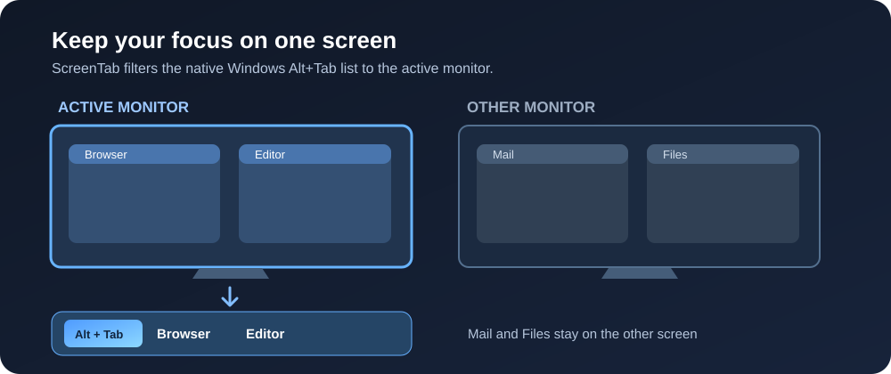

<div align="center">
  

# ScreenTab

**The native Windows 11 Alt+Tab switcher, focused on your current monitor.**

ScreenTab shows windows from the monitor you're using while keeping Windows' own Alt+Tab interface and thumbnails.

[Download the latest release](https://github.com/Manjushri33/ScreenTab/releases/latest) · [Report a problem](https://github.com/Manjushri33/ScreenTab/issues/new) · [How it works](docs/ARCHITECTURE.md)

[](https://github.com/Manjushri33/ScreenTab/actions/workflows/build.yml)
</div>



*Illustration only. ScreenTab uses the actual Windows Alt+Tab interface.*

## What it does

- Shows Alt+Tab windows from the monitor with the active window. If there is no suitable active window, it uses the monitor under the pointer.
- Keeps the native Windows 11 switcher, thumbnails, and keyboard behavior.
- Leaves `Win + Tab` / Task View unchanged.
- Offers **Pause**, **Start with Windows**, status, and **Exit** from the system tray.
- Reconnects after Explorer restarts and checks the installed Windows shell before hooking it.

## Download and install

ScreenTab supports **Windows 11 x64** with the standard Windows Alt+Tab switcher. Open the [latest release](https://github.com/Manjushri33/ScreenTab/releases/latest) and choose one of these files:

| File | Use it when |
| --- | --- |
| `ScreenTab-Setup.exe` | You want normal installation, an Installed Apps entry, and an optional Windows startup setting. |
| `ScreenTab-windows-x64.zip` | You want a portable copy. Extract the whole ZIP to a permanent folder, then run `ScreenTab.exe`. Keep the included DLLs beside it. |

The release also contains a `.sha256` file for each download. ScreenTab is not code signed; Windows SmartScreen may show a warning. Check that the file came from this repository's Releases page before choosing **More info → Run anyway**.

On first launch, and after some Windows updates, ScreenTab needs an internet connection to download the matching public Microsoft symbols. It may take a moment before the tray menu says **Status: Working**. If the symbols are temporarily unavailable, ordinary Alt+Tab continues to work and ScreenTab retries.

**Updating from v0.1.0 or v0.1.1:** Install the new setup file over the existing installation. For a portable copy, exit the old app, replace the entire extracted folder, and start the new `ScreenTab.exe`. Keep all files from the same release together.

**v0.1.2 fixes incorrect monitor selection when File Explorer is not open.** Windows can focus a hidden shell window before opening Alt+Tab; ScreenTab now ignores that window and uses the monitor under the pointer.

## Use and status

Press `Alt + Tab` as usual. Right-click the ScreenTab tray icon to see its status and controls:

| Tray item or status | Meaning |
| --- | --- |
| **Status: Working** | Filtering is active. |
| **Checking Windows symbols** / **Starting hook** | ScreenTab is preparing the Windows shell connection. |
| **Waiting to retry** | A temporary symbol or hook error occurred; ScreenTab will try again. |
| **Waiting for Explorer** | Explorer is starting or restarting. |
| **Pause** | Temporarily use ordinary Alt+Tab; select the checked **Pause** item again to resume filtering. |
| **Start with Windows** | Turn automatic startup on or off. |
| **Exit** | Close ScreenTab and restore ordinary Alt+Tab. |

The tray icon's **About** item shows the app version. Its status item provides more detail when a problem occurs.

## Compatibility and troubleshooting

ScreenTab changes an internal Explorer path because Windows does not provide a public API to filter its native Alt+Tab list by monitor. Windows updates can change that path. ScreenTab resolves symbols for the installed Windows build and checks the loaded shell image before enabling its hook. If those checks fail, it leaves normal Alt+Tab available and reports the problem in the tray menu. Compatibility with every future Windows build cannot be guaranteed.

If filtering is not active:

1. Check the tray status and open its status item for details.
2. Confirm that the PC is running Windows 11 x64 and can reach Microsoft's symbol server. First launch and some updates need this connection.
3. Confirm that `ScreenTab.exe`, `ScreenTabHook.dll`, `dbghelp.dll`, `symsrv.dll`, and `msdia140.dll` came from the same release and are in the same folder. The installer places them together automatically.
4. If you use ExplorerPatcher, a third-party task switcher, or another Explorer modification, try the standard Windows 11 switcher.
5. If the issue persists, [open an issue](https://github.com/Manjushri33/ScreenTab/issues/new) with the tray status, Windows build (`winver`), monitor layout, and steps to reproduce it. See [CONTRIBUTING.md](CONTRIBUTING.md).

Windows 10, ARM64, legacy Alt+Tab modes, and third-party task switchers are outside the supported configuration.

## Uninstall

For the installer, use **Windows Settings → Apps → Installed apps → ScreenTab → Uninstall**. For a portable copy, turn off **Start with Windows** if enabled, choose **Exit**, then delete the extracted folder.

## Build from source

You need Windows 11 x64, Visual Studio 2022 with **Desktop development with C++**, CMake 3.24+, Python 3, and internet access for the pinned Microsoft symbol runtime packages. Inno Setup 6 is needed only to build the installer.

```powershell
python -m pip install pillow
python scripts/make_icon.py
.\scripts\fetch_symbol_runtime.ps1
cmake -S . -B build -A x64
cmake --build build --config Release
python -m unittest discover -s tests -v
```

The build output is in `build\Release`. To create the installer, run:

```powershell
& "C:\Program Files (x86)\Inno Setup 6\ISCC.exe" installer\ScreenTab.iss
```

The runtime script downloads pinned Microsoft NuGet packages, verifies their SHA-256 hashes, and copies the x64 libraries into the build. For implementation details, see [the architecture notes](docs/ARCHITECTURE.md).

## Contributing and credits

Bug reports and pull requests are welcome; see [CONTRIBUTING.md](CONTRIBUTING.md). The filtering strategy and relevant shell symbol names were informed by the open-source Windhawk **Alt+Tab per monitor** mod by L3r0y and Windhawk by Ramen Software. ScreenTab is a standalone implementation and does not require Windhawk. Third-party licenses are listed in [THIRD_PARTY_NOTICES.md](THIRD_PARTY_NOTICES.md).

ScreenTab's own source is available under the [MIT License](LICENSE). See [CHANGELOG.md](CHANGELOG.md) for release changes.
